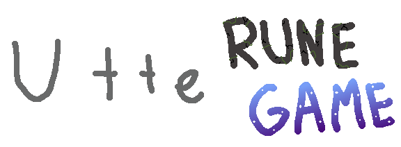

## About
This repository is a game made in the Godot engine for the Game Jame contest: Untitled Game Jame #104. 

## Game
The game is a 2d tactical, turn-based spell caster. In which you play as an astronaut who has crash landed into an alien planet. Upon which you are forced to defend yourself from the wildlife using ancient runes sold by a robotic shop keeper.

## Itch.io download page
[Untitled Rune Game](https://comradewolfskii.itch.io/untitled-rune-game)

## Credits
Rune Art: MistyPluto

Art & Animation : Comrade_Wolfskii

Shop art: LordXam

Programming:
Comrade_Wolfskii
LordXam
Bigtroublejake
MistyPluto
Crazybaconmaster
